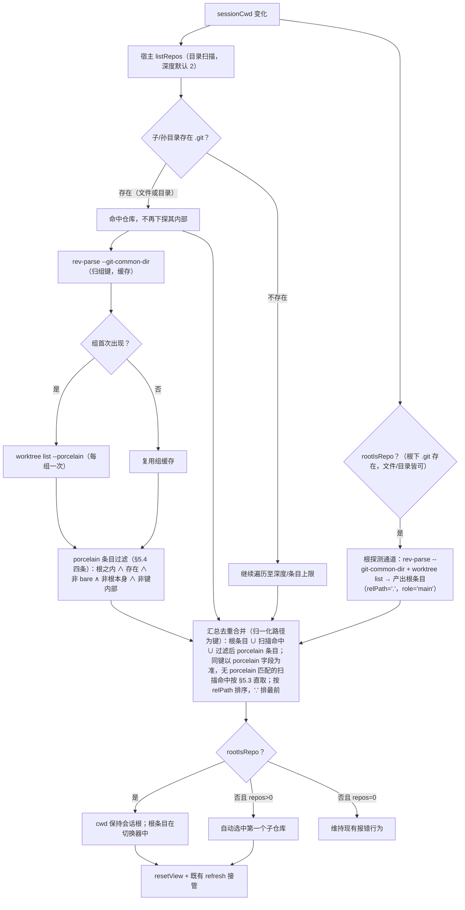

# 子代码库管理功能规格（扫描 + 切换 + Worktree 归组）

> 迭代：git-multi-repo · 状态：**rev1.7 — rev1.6 基础上再吸收 UI 验收反馈（两下拉风格统一：仓库胶囊补图标 + optgroup 分组标签配色，决策 37；扫描与契约不变）**
> 依据：需求澄清会话 5 轮 + 真实 git 实测（§3）+ spec-checker 对抗性审查 + Lead 复验（junction 行为纠偏 / submodule 幽灵条目 / realpath 双实现分裂，均独立实测）

## 1. 需求

在 dsh-git-graph 插件（当前 Git 面板绑定会话工作目录单仓库）基础上增加子代码库管理：

- 扫描会话工作目录的子目录（深度 1）与孙目录（深度 2），发现其中的 git 仓库；
- 在 Git 面板 UI 上列出并一键切换这些仓库；
- 正确处理同一项目的多个 git worktree（发现、归组、区分展示、组外过滤）。

**非目标（v2 再做）**：worktree 增删管理（worktreeAdd / Remove / Prune）、localStorage 记忆上次选择、每仓库 self 标注。

## 2. 场景与术语

| 术语 | 含义 |
|---|---|
| 扫描根 | 会话工作目录（sessionCwd），即 `listRepos` 的 `path` |
| 主仓 / 主 worktree | `.git` 为目录的仓库本体 |
| linked worktree | `git worktree add` 产生的附加检出，其 `.git` 为文件（内容为 `gitdir:` 指针） |
| 组 | 同一仓库的全部检出（主仓 + 兄弟 worktree）；`worktree list` 从任一成员返回全组 |
| 组外 worktree | 路径位于扫描根之外的组成员 |

两种受支持布局（均无需特例代码，文档引导）：

- **布局 A（同级）**：`root/proj`（主仓）、`root/proj-fix`（worktree）、`root/frontend`（无关仓库）。适合功能并行开发。
- **布局 B（主仓内部）**：`root/proj`（主仓）、`root/proj/worktrees/fix`（worktree）。适合临时/隐藏式 worktree；主仓需在 `.git/info/exclude` 排除 `worktrees/` 以免 status 污染（文档引导，代码不特判）。

## 3. 实测依据（方案事实基础，spec-checker 应复验）

1. linked worktree 的 `.git` 是**文件**而非目录 → 扫描判定必须「存在即命中」，不得要求目录。
2. `git worktree list --porcelain` 从组内任一成员执行返回**同一全组列表**（含组外兄弟）；条目含路径、HEAD、branch/detached、bare/locked/prunable 注记。
3. `git rev-parse --git-common-dir` 从任何成员指向主仓 `.git`，为天然归组键；禁止手工解析 `.git` 文件的 `gitdir:` 行。
4. 同一分支同一时刻仅能被一个 worktree 检出；占用冲突时 git 报 fatal（含占用方路径），可直接透传给用户。
5. worktree 放主仓内部会污染主仓 status（`?? worktrees/`）；`git clean` 对嵌套仓库条目有防护（`Would skip repository`），但该防护不覆盖同级布局。
6. porcelain 路径在 Windows 使用正斜杠（`C:/Users/...`）→ 一切路径比较前必须归一化（resolve 后再 relative）。
7. worktree 目录被手删后注册表仍列出该条目（带 prunable 注记）→ 存在性检查是必要兜底。
8. `git -C <worktree>` 的全部日常操作（status/diff/commit/push 等）开箱即用 → 现有 30+ op 零改动承诺成立。

## 4. 方案总览

改动面：`lib/index.js`（新增 listRepos op 与纯函数导出）、`lib/client.js`（直接编辑）、`scripts/patch-client.mjs`（追加 Patch 18）、`test/`（三类新增测试 + 3 个预存测试的平台中立修复，见 §7）、`README.md` / `README.en.md` / `CHANGELOG.md` / `CHANGELOG.en.md`。**现有 30+ 个 /git op 与既有 UI（分支胶囊/提交图/暂存提交推送）零改动。**

## 5. 宿主侧设计（lib/index.js）

### 5.1 API 契约

请求：`{ "op": "listRepos", "path": "D:/root", "depth": 2 }`（depth 缺省 2，钳制 1–4）。

响应 `value` 字段：

| 字段 | 类型 | 说明 |
|---|---|---|
| root | string | 扫描根绝对路径（入口经 realpath 归一化，消除 8.3 短名差异） |
| rootIsRepo | boolean | 根下 `.git` 存在（接受文件态，覆盖根为 worktree 的场景） |
| repos | array | 按 relPath 排序 |
| truncated | string | 非空 = 因防护截断的原因（既是排查信息也是 UI 提示） |

`repos[]` 每项：

| 字段 | 类型 | 说明 |
|---|---|---|
| path / relPath / name | string | 绝对路径 / 相对扫描根（根仓库条目为 "."）/ basename |
| branch | string | 检出分支；detached 时为空串 |
| head | string | HEAD 短哈希（8 位） |
| group | string | 归组键（`--git-common-dir` 归一化后），同组仓库一致 |
| worktree.role | "main" \| "linked" | 主仓 / 附加检出 |
| prunable | string | 非空 = git 给出的失效原因（目录仍在则保留并展示徽标） |

### 5.2 扫描算法

- **判定**：`.git` 存在即命中（lstat；文件或目录皆可，天然覆盖 worktree/submodule 的**发现层**；submodule 结果层条目由 §5.4 第 4 条过滤 + §5.3 直取规则保证）。
- **入口归一化**：请求 path 先做 `fs/promises` 的 `realpath`（8.3 短名 → 长名、junction → 真实路径），失败（路径不存在，ENOENT）即 op 失败；扫描、路径归一化基准、响应 root 均以归一化后路径为准（porcelain 输出为长名正斜杠形态，短名根会使 in-root 判定与 role 判定全数失配——本机 TEMP 实测即 8.3 形态）。**API 钉死（Node v24 实测，rev1.4）**：必须用 `fs/promises` 的 `realpath`——该入口走 libuv native 实现，8.3 短名（`ADMINI~1`）与 junction 均正确展开为长名真实路径；**禁止** `fs.realpathSync` / 回调版 `fs.realpath`（JS 实现，实测原样返回 8.3 短名不展开，照抄会静默失效）；`fs/promises` 上不存在 `realpath.native`（实测 TypeError）。
- **遍历**：`readdir withFileTypes`；跳过 `SKIP_DIRS`（复用现有集合）、一切点开头目录、符号链接（防循环）；命中仓库后**不再下探其内部**（内部成员由 worktree list 通道发现）。
- **深度**：默认 2（子 + 孙）；请求可传 1–4，越界钳制。

### 5.3 Worktree 归组与信息获取

- **根探测通道（rootIsRepo=true 时启用）**：对会话根本身执行一次 rev-parse + `worktree list --porcelain`，产出根条目（relPath="."，worktree.role="main"）。**数据层约定**：根条目 role 固定 "main"——会话根即用户主工作面，即使根本身实为 linked worktree；此为通用 role 语义（下方 role 判定规则）的已知例外，仅作用于数据层，UI 不消费 role 字段。根条目不依赖全量扫描（扫描只看子/孙目录）。
- 每个命中仓库先 `git rev-parse --git-common-dir`（归一化作归组键）；键缓存命中则跳过后续调用。
- **归一化规则（写死）**：common-dir 原始输出在主仓根为相对路径 `.git`、主仓子目录为 `../.git`、仅 linked worktree 为绝对路径；同组仓库若直接拿原始输出当 key 会分裂成多组。**key = `path.resolve(该仓库路径, commonDirRaw)`，再统一正斜杠**。
- 组首次出现时执行一次 `git worktree list --porcelain`：同时获得组内全部成员的分支 / detached / head / bare / locked / prunable。
- **worktree.role 判定（写死）**：porcelain 不标注 main/linked。判定规则：**条目路径 resolve 后等于「归组键的父目录」者为 main；其余为 linked**。该规则在「bare 主仓被过滤后组内只剩 linked」场景下仍正确（bare 主仓路径 ≠ 归组键父目录——归组键指向 `<bare>.git`，其父目录是 bare 仓所在目录而非 bare 仓本身路径；此时组内全部条目均为 linked，属正确结果）。
- 解析容错：未知 annotation 行直接跳过（向前兼容新 git 版本）；`branch refs/heads/xxx` 剥前缀取短名；条目按 `worktree <path>` 行分块（或空行分隔），bare 条目无 HEAD/branch 行，head/branch 容错为空；`HEAD` 行为 40 位全长哈希，统一截取前 8 位作为 head（与直取路径口径一致）。
- **scan hit 字段匹配与直取（submodule 补齐）**：扫描命中仓库先按归一化路径在本组过滤后 porcelain 条目中匹配——命中则字段取该条目；无匹配（submodule：其组 porcelain 唯一条目路径为 gitdir 位置，已被 §5.4 第 4 条过滤剔除，真实工作目录不在列表中）→ 以该仓路径直取：`worktree.role = "linked"`（工作目录 ≠ 归组键父目录）、`branch = rev-parse --abbrev-ref HEAD`（detached → 空串）、`head = rev-parse --short=8 HEAD`（恒有值；`--short=N` 的 git 语义是「最小 N 位 + 前缀碰撞自动延长」，海量对象仓库的极端场景可能长于 8 位——契约侧按哈希前缀消费，UI 仅用于 detached 展示，无功能影响）、`prunable = ""`。**`--short=8` 为 rev1.4 实测勘误**：`--short` 输出 git 认为的最小唯一长度（本机实测 7 位），与 §5.1「head 为 8 位」契约冲突——会话根恰为 submodule 工作目录时根条目正走此直取路径，实测暴露该不一致；显式 `--short=8` 修齐，旧版 git 不支持该参数时退回 `rev-parse HEAD` 截 8 位。

### 5.4 过滤规则

`worktree list` 带出的条目进入响应需**同时**满足：

1. 位于扫描根之内（归一化后 `relative` 不以 `..` 开头、非绝对、且**不等于根本身**——根条目已由根探测通道产出，本通道剔除避免重复）；
2. 目录仍然存在（剔除手删后的注册表残留）；
3. 非 bare（porcelain 标注 `(bare)` 的条目剔除）；
4. **不在归组键内部**：条目路径归一化后**既不等于归组键、也不位于归组键目录内部**。实证（spec-checker 发现、Lead 独立复现）：submodule 从其工作目录执行 porcelain，唯一条目路径为 gitdir 位置（`<主仓>/.git/modules/...`）而非工作目录——该条目恰位于键内部，被本条剔除；主仓组 / linked 组 / bare 组全部正常条目均不在键内，零误伤。

**合流语义（写死，消除 union / porcelain-only 二义）**：repos = 根条目 ∪ 扫描层命中 ∪ 过滤后 porcelain 条目，以归一化路径为键**去重**——同键时以 porcelain 条目字段为准（扫描命中与 porcelain 条目通常同指一仓），去重后计数入 §5.5 的 50 上限；扫描层命中不经本过滤（本就在根内且存在），无 porcelain 匹配的扫描命中按 §5.3 直取规则补字段。prunable 但目录仍在的条目保留，原因透传 UI 徽标。**组外 worktree 不进切换器**（发现机制忠于「本工作区」语义）。若某组经根外过滤后无任何根内成员且根也非该组成员，则该组整体不出现（空组丢弃）。

### 5.5 防护上限（对齐现有 MAX_* 风格）

- repos ≤ 50；遍历目录条目 ≤ 5000；整体超时 ≤ 10s（`Promise.race` 外层计时，`git()` 逐命令维持现有 60s 默认超时——listRepos 的子命令本身轻量，10s 外层先到即整体返回）。
- **超时语义**：超时已完成的子结果保留进 repos，`truncated = "timeout"` 一并返回（部分结果优于无结果）。
- **超时后的子进程**：不额外 kill——在跑的 rev-parse / worktree list 子命令按各自 60s 上限自行收敛，迟到结果直接丢弃（响应已返回）；实现禁止自行加进程树 kill 逻辑（Windows 上添乱）。
- **截断语义**：repos 超 50 时，先按 relPath 排序再取前 50（保证确定性：同名前缀目录稳定）；`truncated = "repos"`。目录条目超 5000 停止遍历，`truncated = "dirs"`。多次触发取最深原因或拼接（实现自定，单测覆盖）。
- **depth 语义**：请求缺省 = 2；非法值（0 / 负数 / 非整数 / 非数值）一律落缺省 2，合法范围 1–4 之外的整数钳制到边界。
- 全异步 `fs/promises`，不阻塞事件循环。
- 触发任一上限 → 响应 `truncated` 携带原因，不引 console 日志（现有宿主半无日志通道）。
- **纯函数导出**（扫描器、porcelain 解析器、路径归一化助手）供单测，仿 `parsePorcelainLine` 模式；扫描器接受**注入式上限参数**（maxRepos / maxEntries / 钉入目录工厂），单测直接用小上限触发截断，无需造 51 个真实仓库。
- **并行化**：命中仓库的 rev-parse 调用按 `Promise.all` 并行；worktree list 依赖归组结果，按组就绪后串行/小并发执行（Windows spawn 开销大，避免 10s 超时误报截断）。

### 5.6 Windows junction 说明（实测纠偏）

spec-checker 建议对 junction（目录联接）补 reparse-point 检查。**Lead 已实测（Node v24.14.1 / Win 环境）：junction 在 `readdir withFileTypes` 的 Dirent 与 `lstat` 上均报告 `isSymbolicLink() === true && isDirectory() === false`**。即 §5.2「跳过符号链接」规则**已天然覆盖 junction**，无需额外防护代码；实现不得画蛇添足加 reparse 检查（避免 ConstrainedLanguage 兼容问题与多余开销）。此条以实测事实为准，推翻审查建议。

### 5.7 实现约束

- 新增代码注释用中文（存量英文注释不改动，保持 diff 最小）；扫描器/归组/过滤等关键逻辑必须注释功能、参数、边界。
- 不新增 HTTP 路由（仅挂现有 `/git` handlers 表）；不触碰与桌面内置 viewer 的路由共存逻辑。

## 6. 客户端设计（Patch 18）

### 6.1 UI

- 顶栏新增「仓库」胶囊，位于 Git 标题与分支胶囊之间；克隆 Patch 14 的原生 `<select>` 覆盖模式（复用 `.dshGitBranch` / `.dshGitBranchSelect` 样式族；移动端 flex-wrap 天然兼容）。
- option 文案（rev1.5 验收修订）：`name（branch）`——仓库名优先；detached → `name（游离 head）`（◻ 字符弃用）；relPath 与显示名不一致时追加「· 位置」消歧（根仓为「根」、嵌套仓为相对路径）；prunable → 追加「⚠ 疑似失效」。
- option value = 仓库绝对路径；当前选中显示 name、title 显示完整 path。
- **显示条件**：`repos.length > 0 且（repos.length > 1 或 !rootIsRepo）`——单仓且根即仓库时隐藏胶囊，现状 UI 不变。
- **弹层配色（rev1.6 验收修订）**：`.dshGitBranchSelect` 叠加层用 `color:transparent` 隐藏自身，但原生 select 弹层的 option 文字颜色继承 select → 弹层白底白字不可见；追加 `.dshGitBranchSelect option{color:var(--dsw-alias-label-primary);background-color:var(--dsw-alias-bg-base)}` 显式配色（仓库/分支两个下拉共用该类，一并修复）。
- **两胶囊风格统一（rev1.7 验收修订）**：仓库胶囊补 RepoIcon（内联 SVG 文件夹剪影，`currentColor` 继承胶囊文字色；不用 primitives 图标导出——图标名曾在 dsh 升级时改名，BranchIcon 已被迫做回退解析，内联免疫），与分支胶囊结构对齐为「图标 + 名称 + 折叠符」；optgroup 分组标签（本地分支/远程分支/标签）追加显式配色 `.dshGitBranchSelect optgroup{color:var(--dsw-alias-label-tertiary);background-color:var(--dsw-alias-bg-base);font-style:normal;font-weight:600}`（分组标签同样继承透明色，否则弹层每组开头出现空白行）。
- **truncated 呈现**：非空时在切换器首行插入一个 `disabled` 提示 option（文案「⚠ 列表已截断：{truncated}」），仓库胶囊 title 同步追加原因；不占 value、不影响选中逻辑。

### 6.2 状态流

- `sessionCwd` effect → `listRepos` → `setRepos`。
- **响应乱序防护**：listRepos 响应携带请求序号（或以闭包比对最新 sessionCwd），旧响应到达时丢弃，防止连续切换会话时旧结果覆盖新结果。
- **cwd 挂起语义**：sessionCwd effect 先 `setCwd(sessionCwd)`（现状不动）；listRepos 返回后若 `!rootIsRepo && repos.length > 0` → `setCwd(repos[0].path)`（自动进第一个子仓库，**顺带修复现状：会话根非仓库时面板直接报错**——非仓库根场景中间会短暂显示错误再纠正，接受该一次性闪烁，不为它复杂化时序）；`rootIsRepo` → cwd 保持会话根。
- **双 effect 结构（防重入循环，必须遵守）**：依赖 `[sessionCwd]` 的 effect 只发起 listRepos（含乱序防护）；依赖 `[sessionCwd, repos]` 的 effect 只做选仓判断、不发请求。禁止「依赖含 repos 且体内 setRepos」的单 effect——repos 引用变化会重入触发请求风暴。
- **响应新鲜度守卫（防跨会话脏数据，必须遵守）**：发起 listRepos 的闭包捕获请求时的 sessionCwd，响应落地时随 repos 一并保存为 tag；选仓 effect 首判 `tag === sessionCwd` **相等才允许动作**，否则本轮 no-op；sessionCwd 变化时（`[sessionCwd]` effect 体内）同步清空 repos 与 tag，旧会话数据不再渲染切换器——tag 守卫由此转为纵深防御。机理：sessionCwd 变化后、新响应到达前的窗口内，repos / rootIsRepo 仍是**上一会话**的值——旧会话为「根非仓库且有子仓」时，脏运行满足自动选首仓条件，会把 cwd 劫持到旧会话首仓；若新会话为仓库根或无子仓，新响应到达后选仓判断本身 no-op，cwd 粘滞在错误仓库（人工验收 ②→④ 连续切换即触发）。**不采用「响应 root === sessionCwd」比较**：root 经宿主 realpath 归一化为长名形态（§5.2），sessionCwd 可能为 8.3 短名形态——本机实测同机不同进程两种形态并存，且 8.3 短名路径下 porcelain 输出为长名正斜杠形态（git 自行解析短名），直接字符串比较会永不相等、守卫永久卡死、自动进首子仓静默失效；tag 与 sessionCwd 同源同形态，精确相等即可，同样满足「与 effect 声明顺序无关」。乱序防护丢弃旧响应（防旧响应覆盖新状态），本守卫拦「旧状态触发新动作」，二者互补。listRepos 请求失败（op 错误）时清空 repos 与 tag——不沿用旧会话数据渲染切换器，回落现状 UI。
- **「用户已手动选择」ref 生命周期**：ref 在 sessionCwd 变化时**复位**（手动选择的作用域 = 当前会话根）；跨会话不复位会在「根非仓库、有子仓」的新会话里错误抑制自动选首仓，cwd 停在非仓库根报错——与本条自称「顺带修复」的现状 bug 同形。
- 用户切换 → `setCwd(repo.path) + resetView()`；既有 `activePath` effect 自动触发 refresh，状态/分支/差异/历史全面板跟随。
- 分支被兄弟 worktree 占用的切换冲突：透传 git stderr（信息已含占用方路径，v1 足够；v2 才做引导切换）。

### 6.3 resetView()

切仓库时清空右栏与选择残留：`diffFile`、`diffFileRef.current`、`diffText`、`diffTruncated`、`diffStaged`、`selectedCommit`、`commitFiles`、`commitFile`、`selectedCommitText`、`commitDiffTruncated`、`rightTab`（回 "diff"）、`fileViewText`、`fileViewHeadText`、`fileLog`、`blameLines`、`error`、`output`、`message`（提交说明草稿——不清空会把旧仓草稿误提交到新仓）、`msgRef.current.style.height` 重置（受控 textarea 的高度只在 onChange 里重算，`setMessage("")` 的受控值变化不触发 onChange，不清内联高度会残留一个高的空输入框）。

**不清空项（有意保留）**：`newBranchName`、`mergeTarget`、`confirmDelete`、`modal`、`historyH`（面板级偏好/瞬时 UI 态，切仓库无残留语义）。

### 6.4 构建链约束（关键风险，必须遵守）

- `lib/client.js` 是已含 17 个补丁的权威产物；raw bundle 不在仓库内，**无法整链重放**。
- 执行方式：**直接编辑 `lib/client.js`** 达到「Patch 18 应用后」的等价状态；**同步在 `scripts/patch-client.mjs` 末尾追加 Patch 18**（锚点取当前已补丁文本，count 校验与现有补丁风格一致）。
- **锚点选取双约束**：Patch 18 锚点必须在 Patch 17 应用后的产物中**唯一出现**；且不得包含会被后续 patch 再替换的文本。bundle 内已存在的文本片段作锚时，须先全文检索确认当前仅出现一次。
- **补丁文本互斥约束（由 §7 新增 bundle 断言测试在最终产物上执行）**：Patch 11 的 3 次计数只作用于 raw→补丁前文本（执行顺序在 Patch 18 之前），管不到新增文本；新增文本的互斥由新 bundle 断言测试在**最终产物**上执行——**裸 `props.useSessions` 出现次数 === 2**（Patch 18 必须复用现有 sessionCwd 通道，不得新增第三处调用）；**完整 scoped 串 `@deepseek-ai/dsh-git-graph` 出现次数 === 0**（必须匹配完整串而非 `@deepseek-ai` 前缀——bundle 内 `require("@deepseek-ai/dsh-client-ui-primitives")` 合法存在，前缀匹配会假阳性）；**`primitives.IconBranchOutline16,` 出现次数 === 0**（primitives-compat.test.js 既有扫雷同步覆盖）；**Button 之外的 `primitives.X` JSX 直接引用新增数 === 0**（primitives-compat.test.js 仅放行 `primitives.Button` 直引——Patch 18 克隆 Patch 14 原生 select/option 天然满足，此条为防御性断言，防后续维护误引入 Badge/Tooltip 等直引在测试期爆雷）。
- 一致性守护：新增 bundle 断言测试（仿 `test/client-cwd.test.js` 读产物断言模式）。
- `patch-client.mjs` 仅能从 raw bundle 起跑（对当前产物重跑会失败，这是已知现状，本次不修）。

## 7. 测试计划

| 类别 | 文件 | 覆盖 |
|---|---|---|
| 单测 | `test/parse.test.js` 追加 | 扫描纯函数：子/孙命中、深度钳制与非法 depth 落缺省、跳过规则（SKIP_DIRS/点目录/符号链接）、`.git` 文件与目录双态、命中不下探（repo 内嵌 repo 不被全量层发现）、注入式小上限触发截断与截断语义（排序后取前 N）；porcelain 解析：branch/detached/bare/prunable/未知行容错/`refs/heads/` 前缀剥除/按 worktree 行分块/HEAD 行截前 8 位/bare 条目无 HEAD 容错；路径归一化（common-dir 相对/绝对三形态 → 同组同 key）；role 判定（含 bare 组用例）；submodule 样例（gitdir 幽灵条目被 §5.4 第 4 条过滤剔除、工作目录按 §5.3 直取字段 role="linked"）；入口 realpath 归一化（8.3 短名根 → 长名基准，与 porcelain 长名条目匹配成功） |
| 集成 | `test/integration.test.js` 追加 | 真实 git 建目录：同级 worktree + 主仓内嵌 worktree + 根外 worktree + 手删残留 + 孙目录普通仓库 + bare 主仓挂 linked worktree + rootIsRepo 三态（根为主仓 / **根为 worktree——根 `.git` 为文件** / 根为空目录）；HTTP 端到端断言发现/归组/过滤/根条目（两种仓库根形态下 role 均为 "main"，§5.3 数据层约定）/排序（'.' 最前）/truncated（经注入上限参数，不造 51 仓）；submodule 布局（根为含 submodule 的超项目 → 子模块工作目录以 role="linked" 入列、`.git/modules/` 幽灵条目与重复条目均不入列） |
| bundle 断言 | `test/` 新文件 | `lib/client.js` 含仓库胶囊关键标记（含 §6.1 显示条件、resetView、listRepos 调用）；`scripts/patch-client.mjs` 含 Patch 18 段；同时断言四条互斥红线未触（无第三个 useSessions、无 `@deepseek-ai/dsh-git-graph` 完整字样新增、无 `primitives.IconBranchOutline16,`、无 Button 之外的 `primitives.X` JSX 直引新增） |

测试要求：`node:test`、无网络依赖、git >= 2.28（既有约定）、临时目录自清理。

**预存测试缺陷修复（用户决策：顺手修掉本机 3 个预存失败，纳入本迭代改动面）**——改动限定在测试文件内，不动产品代码；修法须平台中立（行尾与路径）：

1. `test/primitives-compat.test.js`「BranchIcon resolves」：正则 `;\\n` 在 CRLF 检出（Windows core.autocrlf）下失配 → 改用 `;\\r?\\n` 行尾中立匹配。
2. `test/parse.test.js`「safePath keeps paths under the root」：期望值硬编码 POSIX 路径 `/repo/a.txt` → 改用 `path` API（`path.resolve`/`path.join`）构造期望值，平台中立。
3. `test/integration.test.js` after() EBUSY：Windows 句柄延迟释放致临时目录清理偶发失败 → 清理加重试/短退避，仍失败则跳过清理（残留目录无害，已在测试注释中说明边界）；after 钩子的主体逻辑不改。

修复验收：这 3 个用例在本机 Windows 与 CI ubuntu 下都通过；修复改动与 git-multi-repo 新增改动在变更清单中**分开列出**，供 reviewer 区分审查。

**§11.4 UI 验收为人工清单**（无浏览器 E2E 基建，bundle 断言只测标记存在）：按 README「使用」节操作——① 会话根为主仓 + 同级 worktree → 胶囊显示两选项，切换后右栏清空、分支胶囊/提交图显示新仓数据；② 会话根为空目录含子仓 → 自动进第一个子仓；③ 单仓且根即仓库 → 胶囊隐藏（现状 UI 不变）；④ 会话根非仓库且无子仓 → 现状报错不变。

## 8. 文档更新

- `README.md` / `README.en.md`：API 表加 `listRepos` 行；「使用」节加仓库切换说明与上述 §7 人工验收清单；新增「多仓库与 worktree 布局指南」（同级 = 功能并行开发；主仓内部 = 临时/隐藏式 + exclude 引导）；写明 SKIP_DIRS 后果（node_modules 内仓库不发现——pnpm 布局用户须知）；「安全」节补 git clean 防护边界（保嵌套不保同级）。
- `CHANGELOG.md` / `CHANGELOG.en.md`：新条目（英文版同步，不落后）；`package.json` 版本 0.1.6 → 0.2.0（新功能，语义化 minor）。
- `AGENTS.md`：目录索引节补 spec/git-multi-repo 一行（迭代文档位置），文件保持 ≤100 行。

## 9. 不改动范围（风险边界）

- 现有 30+ `/git` op 零改动（实测依据 §3.8）。
- 既有 UI（分支胶囊、提交图、暂存/提交/推送）不动。
- 自举保护（`status.self` + 切标签确认）对新仓库自动生效，不特判。
- 不做：localStorage 记忆、worktree 增删管理（v2）、每仓库 self 标注（v2 可选）。
- 不改 `package.json` 的 dsh 注入声明与 `cordis.patch.yml`（无新路由/页签）。
- 唯一例外（rev1.1 用户决策）：§7「预存测试缺陷修复」的 3 个测试文件改动——**仅限测试文件**，产品代码（lib/、scripts/）存量逻辑不动。

## 10. 已收敛决策口径

1. 扫描深度默认 2（子+孙），请求可传 1–4；非法值落缺省 2。
2. 命中仓库后不再下探其内部（内部成员走 worktree list 通道）。
3. 每组一次 `worktree list --porcelain` 同时拿分支/兄弟/标志（rev-parse 归组键缓存；key = resolve(仓库路径, commonDirRaw) 归一化）。
4. detached worktree 显示短哈希。
5. 组外 worktree 不进切换器（根内 + 存在过滤）。
6. 分支被兄弟占用 → 透传 git 报错（v2 才做引导切换）。
7. 裸仓不识别（`.git` 存在性判定天然不命中）+ porcelain bare 条目过滤。
8. locked/prunable 透传 + UI 失效徽标。
9. 嵌套布局 status 污染 → 文档引导 `.git/info/exclude`，代码不特判。
10. worktree 管理操作 = v2；本次只做发现 + 切换。

**rev1 补充决策（spec-checker 审查吸收）**：

11. 根条目由根探测通道显式产出（rootIsRepo=true 时对根做 rev-parse + worktree list），relPath="."、role="main"；worktree list 通道剔除根本身防重复；排序 '.' 最前。
12. worktree.role 判定 = 条目路径 resolve == 归组键父目录者为 main，其余 linked（bare 组余下全 linked 属正确）。
13. 归组键归一化 = `path.resolve(仓库路径, commonDirRaw)`（三种原始形态 → 同组同 key）。
14. junction 无需特判（Node dirent/lstat 已报 isSymbolicLink=true，实测推翻审查建议 6）。
15. 10s 超时 = 外层 Promise.race，子命令维持现有 60s；超时保留已完成部分结果 + truncated="timeout"。
16. rev-parse 并行（Promise.all），worktree list 按组就绪后执行。
17. 扫描器注入式上限参数进纯函数导出，单测小上限触发截断；repos 截断先排序后取前 50。
18. UI 验收走人工清单（§7 末尾四步），bundle 断言测标记 + 三条互斥红线（useSessions 计数 / 完整串 `@deepseek-ai/dsh-git-graph` 零出现 / IconBranchOutline16）。
19. resetView 增清 `message`；`newBranchName`/`mergeTarget`/`confirmDelete`/`modal`/`historyH` 有意保留。
20. 响应乱序防护：旧 listRepos 响应丢弃（序号/闭包比对）；用户已手动选择后 repos 变化不覆盖（ref 记录）。

**rev1.1 用户决策（2026-09-30，开工前口径确认）**：

21. SPEC rev1 确认为实现与审查的唯一基线（10 条原始决策 + 10 条审查补充决策，以文件当前文本为准）。
22. 本机 3 个预存测试失败（CRLF 正则 / POSIX 路径硬编码 / EBUSY 清理）由本迭代顺手修复，改动限定测试文件，修法平台中立（详见 §7 修复段）。
23. 版本号 0.1.6 → 0.2.0（新功能语义化 minor）。

**rev1.2 补充决策（spec-checker 复审吸收，2026-09-30）**：

24. 客户端双 effect 结构：`[sessionCwd]` 只发 listRepos，`[sessionCwd, repos]` 只做选仓判断——防重入请求风暴。
25. 「用户已手动选择」ref 在 sessionCwd 变化时复位（作用域 = 当前会话根）。
26. 根条目 role 固定 "main"（数据层约定，UI 不消费）。
27. 互斥红线由新增 bundle 断言测试在最终产物上执行：`props.useSessions` === 2、完整串 `@deepseek-ai/dsh-git-graph` === 0、`primitives.IconBranchOutline16,` === 0。
28. resetView 显式重置 `msgRef.current.style.height`；10s 超时不 kill 子进程（60s 自行收敛，迟到结果丢弃）。

**rev1.3 补充决策（spec-checker 第二轮 2 阻断 + 3 建议修复，阻断 1 经 Lead 独立实测复现，2026-09-30）**：

29. porcelain 条目第 4 条过滤：条目路径不在归组键内部、不等于归组键（剔除 submodule gitdir 幽灵条目，主仓/linked/bare 组零误伤）。
30. 合流语义写死：repos = 根条目 ∪ 扫描命中 ∪ 过滤后 porcelain 条目，归一化路径去重，同键 porcelain 字段优先；无 porcelain 匹配的扫描命中（submodule 工作目录）直取字段（role="linked"、rev-parse 直查 branch/head）。
31. 入口 `fs.realpath` 归一化（8.3 短名 → 长名）；§6.4 增第 4 条红线（Button 之外 primitives JSX 直引新增 === 0）；truncated UI 落点 = 切换器首行 disabled 提示 option + 胶囊 title。

**rev1.4 补充决策（spec-checker 终审 1 阻断闭合 + 2 条口径备注，2026-10-01）**：

32. 选仓 effect 新鲜度守卫：发起闭包捕获请求时的 sessionCwd，响应落地随 repos 保存为 tag，选仓 effect 首判 `tag === sessionCwd` 才动作——防上一会话的 repos/rootIsRepo 在新响应到达前触发自动选仓、劫持并粘滞 cwd（与乱序防护互补：一防旧响应覆盖状态，一防旧状态触发动作），并使选仓动作与 effect 声明顺序无关；不采用响应 root 比较（realpath 长名 vs sessionCwd 可能的 8.3 短名，形态失配会永久卡死守卫，本机实测两种形态并存）；listRepos 失败清空 repos 与 tag，回落现状 UI；sessionCwd 变化时（`[sessionCwd]` effect 体内）同步清空 repos 与 tag，旧会话数据不渲染切换器。同批口径备注：决策 18 红线措辞对齐 §6.4（idOld 字样 → 完整串 `@deepseek-ai/dsh-git-graph` 零出现）；§10 标题移除过期计数。
33. 入口归一化 API 钉死为 `fs/promises` 的 `realpath`（libuv native 实现，实测 8.3 短名与 junction 均正确展开；`fs.realpathSync` / 回调版为 JS 实现，实测不展开 8.3——决策 31 原文的 `fs.realpath` 字样照抄会静默失效，勘误）。
34. 直取路径 head 固定 8 位：改用 `rev-parse --short=8 HEAD`（不支持该参数时退回 `rev-parse HEAD` 截 8 位）。实测会话根为 submodule 工作目录时 porcelain 无该工作目录条目、根条目正走直取路径，而 `--short` 输出 git 最小唯一长度（本机 7 位），与 §5.1「head 为 8 位」契约冲突；§5.3 同步勘误。**复核补充（spec-checker）**：`--short=N` 的 git 语义是「最小 N 位 + 前缀碰撞自动延长」（实测 `--short=1` 输出 4 位），故「8 位」应理解为「至少 8 位」；porcelain 路径与回退路径为固定截断，极端大仓下两条通道位长可能不同，功能无影响（head 仅用于 detached 展示）；porcelain 路径的 HEAD 行截 8 位规则已写入 §5.3 与 §7。

**rev1.5 补充决策（UI 验收反馈驱动，2026-10-03）**：

35. 切换器 option 文案改为仓库名优先：`name（branch）`；relPath 与显示名不一致时追加「· 位置」消歧（根仓为「根」、嵌套仓为相对路径；单层子仓 relPath === name 不追加）；detached 由 `head ◻` 改为「游离 head」（◻ 在部分 Windows 字体渲染为豆腐块）；§6.1 同步修订。**动因（UI 验收实测取证）**：在「根即仓库 + projects/ 嵌套子仓」的真实工作区（customer_spec / gm-spec 形态，活服务器实测宿主返回 7/6 仓全部正确、扫描无遗漏）下，原 `relPath（branch）` 文案根条目显示 `.（main）`、子仓条目显示 `projects/xxx（长分支名）`——用户反馈「没有展示出清晰明确的名字」「子目录、孙目录好像没有扫描出来」（条目实际在列，但满屏路径无法辨识，两症状同源）；名称优先后两类条目一眼可辨。宿主扫描逻辑与响应契约不变，仅客户端展示层修订。

**rev1.6 补充决策（UI 验收反馈驱动，2026-10-04）**：

36. select 弹层 option 显式配色：`.dshGitBranchSelect` 以 `opacity:0` + `color:transparent` 做透明叠加层（胶囊模式既有写法），但**原生 select 弹层的条目文字颜色继承 select 本身**——透明色被弹层继承后白底白字，下拉开起来像「空的」。追加 `.dshGitBranchSelect option{color:var(--dsw-alias-label-primary);background-color:var(--dsw-alias-bg-base)}`（主题令牌，亮/暗主题自适应），仓库/分支两个下拉共用该类、一并修复；§6.1 同步修订。**动因（UI 验收实测取证）**：rev1.5 后用户仍反馈「只看到一个根，没有看到其他的子项目」——经 Tabbit 直连用户真实标签页取证：DOM 中 6 个 option 齐全、页面内 listRepos 实测返回 6 仓、bundle 为最新修复版，纯 DOM 层一切正常；用户随即自行发现白色弹层上文字同为白色（透明色继承）不可见。此前「子目录没有扫描出来」的观感与本轮同源：条目一直在列，只是弹层文字透明。修复为纯 CSS 追加，宿主契约与扫描逻辑不变。

**rev1.7 补充决策（UI 验收反馈驱动，2026-10-04）**：

37. 两下拉风格统一 + optgroup 空白行修复：① 仓库胶囊补 RepoIcon——分支胶囊为「图标 + 名称 + 折叠符」，仓库胶囊原本无图标；图标用内联 SVG 文件夹剪影（`currentColor` 继承胶囊文字色），刻意不用 primitives 图标导出（`IconBranchOutline16` 曾在 dsh 0.1.7 改名导致 BranchIcon 被迫做回退解析，内联 SVG 免疫此类外部变动）。② 决策 36 的 option 配色不覆盖 optgroup 元素——分组标签（本地分支/远程分支/标签）仍继承透明色，弹层每组开头渲染为空白行（用户反馈「分支下拉有空白的东西」）；追加 `.dshGitBranchSelect optgroup` 显式配色（三级标签色 + 正常字形 + 600 字重，与条目区分层级）。§6.1 同步修订。**动因（UI 验收实测取证）**：决策 36 修复后用户可见两个下拉，随即提出风格差异与空白行；Tabbit 复现页 DOM 转储证实分支下拉 DOM 中无空白 option，空白行即 optgroup 标签。纯展示层修订，契约与扫描逻辑不变。

## 11. 验收标准

1. `npm test` 全绿（Node >= 20、git >= 2.28），存量四类测试零回归；含 §7「预存测试缺陷修复」的 3 个用例在本机 Windows 通过（修复后本机可全绿，CI ubuntu 同样全绿）。
2. 集成测试覆盖 §7 全部布局；过滤语义正确（根外 / 残留 / bare / submodule gitdir 幽灵条目不出现；根条目 relPath="." 且排序最前；repos 无重复归一化路径）。
3. 契约符合 §5.1（字段、排序、truncated）。
4. UI：胶囊显示条件正确；切换后 resetView 生效；`!rootIsRepo` 自动进第一个子仓库；分支胶囊/提交图显示新仓库数据——**按 §7 人工验收清单执行并留存记录**。
5. Patch 18 与 `lib/client.js` 改动一致（锚点在当前产物中唯一 + count 校验 + bundle 断言通过）；四条互斥红线未触（§6.4）。
6. 文档同步（README 中英 + CHANGELOG 中英 + AGENTS.md 索引 + 版本号 0.2.0）。
7. 新增代码中文注释、关键逻辑边界注释齐全（AGENTS.md 规范）。
8. 根条目通道生效：rootIsRepo=true 时根条目必在 repos 中（集成测试覆盖根为主仓与根为 worktree 两种形态；两形态下根条目 role 均为 "main"——§5.3 数据层约定）。
